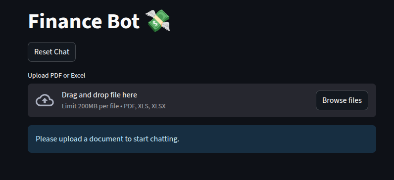

<h2 style="text-align: center;">Financial Bot 💸</h2>

***A powerful AI-powered financial document analysis assistant built with Streamlit and Cohere. Upload your financial documents (PDF or Excel) and get intelligent insights through conversational AI.***

## Features

-   📄 **Document Upload**: Supports PDF and Excel files (.pdf, .xls, .xlsx)
-   🤖 **AI-Powered Analysis**: Uses Cohere's latest language model for intelligent responses
-   💬 **Conversational Interface**: Maintains context across conversations
-   🔄 **Real-time Streaming**: Get responses as they're generated
-   📊 **Financial Data Extraction**: Extract and interpret financial metrics, calculations, and insights
-   🗂️ **Vector Search**: Efficient document search using embeddings
-   🔄 **Chat Reset**: Clear conversation history and uploaded documents

> ***LiveDemo***
[](https://expensyzer.streamlit.app/)

#### Prerequisites

-   Python 3.8 or higher
-   Cohere API key

#### Setup

1.  **Clone the repository**
    
    ```bash
    git clone <repository-url>cd finance-bot
    ```
    
2.  **Install dependencies**
    
    ```bash
    pip install -r requirements.txt
    ```
    
3.  **Environment Variables**
    
    Create a `.env` file in the root directory:
    
    ```env
    COHERE_API_KEY=your_cohere_api_key_here
    ```
    
4.  **Run the application**
    
    ```bash
    streamlit run app.py
    ```
    

#### Usage

1.  Upload Documents

-   Click "Upload PDF or Excel" to select your financial documents
-   Supported formats: PDF, XLS, XLSX
-   The system will process and index your documents automatically

2.  Ask Questions

Once documents are uploaded, you can ask questions like:

-   **Financial Metrics**: "What is the total revenue for 2023?"
-   **Comparisons**: "Compare the profit margins between Q1 and Q2"
-   **Calculations**: "Calculate the debt-to-equity ratio"
-   **Trends**: "Show me the revenue growth trend over the last 5 years"
-   **Specific Data**: "What were the operating expenses in the latest quarter?"

3.  Reset Chat

-   Use the "Reset Chat" button to clear conversation history
-   This also removes uploaded documents and resets the system

#### Key Components

###### File Processing (`utils/file_parser.py`)

-   Handles PDF text extraction
-   Processes Excel spreadsheets
-   Converts documents into searchable chunks

###### Embeddings (`utils/embeddings.py`)

-   Creates vector embeddings for document chunks
-   Manages vector store for efficient search
-   Handles document indexing and retrieval

###### RAG Chain (`utils/rag.py`)

-   Implements Retrieval-Augmented Generation
-   Uses Cohere's language model
-   Maintains conversation context
-   Provides streaming responses

###### Bot Logic (`bot.py`)

-   Handles user queries
-   Manages conversation flow
-   Implements error handling and fallbacks

##### Configuration

**Project Structure**

```
finance-bot/
├── app.py                 # Main Streamlit application
├── bot.py                 # Bot logic and response handling
├── utils/
│   ├── file_parser.py     # PDF and Excel file parsing utilities
│   ├── embeddings.py      # Vector embeddings and store management
│   └── rag.py             # Retrieval-Augmented Generation chain
├── data/
│   └── uploads/          # Temporary file storage
├── requirements.txt      # Python dependencies
├── .env                  # Environment variables (create this according to your choice of secrets)
└── README.md             # This file
```

**Model Settings**

The bot uses Cohere's `command-r-03-2025` model with:

-   Temperature: 0.1 (for consistent responses)
-   Streaming: Enabled
-   Context Window: Last 5 exchanges

**Response Format**

-   All responses are in English
-   Financial figures formatted clearly ($1M, $1,000,000)
-   Calculations shown with plain text symbols (−, /, ×, ≈)
-   Structured formatting with bullet points and numbered steps

#### Requirements

**Core Dependencies**

```
streamlit>=1.28.0
langchain>=0.1.0
langchain-cohere>=0.1.0
cohere>=4.0.0
faiss-cpu>=1.7.4
python-dotenv>=1.0.0
pandas>=2.0.0
openpyxl>=3.1.0
PyPDF2>=3.0.0

```

**Error Handling**

The application includes comprehensive error handling for:

-   Invalid file formats
-   Missing API keys
-   Vector store issues
-   Model response errors
-   File processing failures

**Security Notes**

-   API keys are stored in environment variables
-   Uploaded files are temporarily stored and can be cleared
-   No persistent storage of sensitive data

#### Troubleshooting

###### Common Issues

1.  **"Vector store not found"**
    
    -   Make sure to upload a document first
    -   Check if document processing completed successfully
2.  **"Missing input keys" error**
    
    -   Usually resolves after restarting the application
    -   Clear cache and reset chat if persistent
3.  **Slow responses**
    
    -   Large documents take longer to process
    -   Streaming helps show progress during generation
4.  **API errors**
    
    -   Verify your Cohere API key is valid
    -   Check internet connection
    -   Ensure API quota is not exceeded

##### Performance Tips

-   Use smaller documents for faster processing
-   Reset chat periodically to clear memory
-   Keep questions specific and focused

###### Contributing

Feel free to contribute

1.  Fork the repository
2.  Create a feature branch
3.  Make your changes
4.  Add tests if applicable
5.  Submit a pull request

##### Support

For issues and questions:

-   Check the troubleshooting section above
-   Review error messages in the Streamlit interface
-   Ensure all dependencies are properly installed

##### Acknowledgments

-   Built with [Streamlit](https://streamlit.io/)
-   Powered by [Cohere](https://cohere.ai/)
-   Uses [LangChain](https://langchain.com/) and FAISS for RAG implementation

###### Developer

> [**Moin Khan**](https://www.linkedin.com/in/moin-khan-0335b4245 "https://www.linkedin.com/in/moin-khan-0335b4245")
